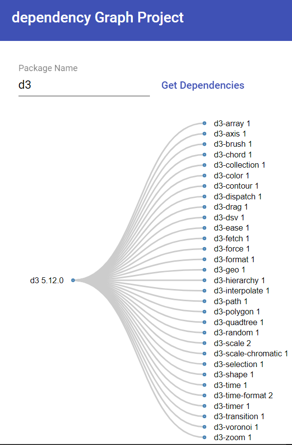
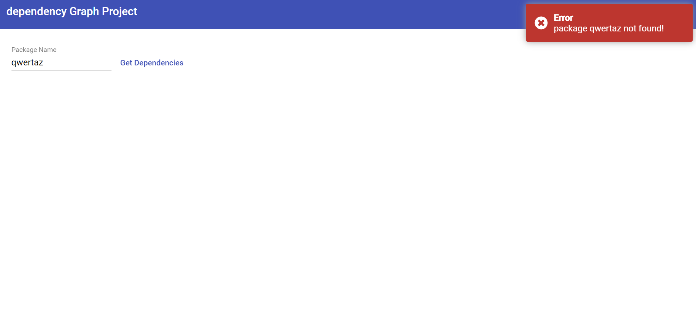
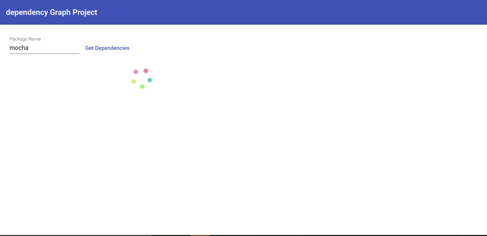

# Npm Package Depedencies Visualization

Demo: 

Project to show npm package dependencies with D3 tree.

**Features**:
* Visualize npm package dependencies with tree.
* Input form validations.
* Spinner when loading data.
* Toaster notification when there is an error(package not found, package name and version not found).
* Collapsible tree nodes on click. 
* Cache is used to cache package version and dependencies, if in another call 
the dependency is found, its returned from the cache.

**Notes**:
* For simplicity if the package version that fetched from the server contains (>,<,~,=) characters, it got deleted.

* If a package contains both > and <, or | or - it will not work.

* For simplicity dependencies under devDependencies is not included in the graph.

Images:

This project was developed with Angular 8.
